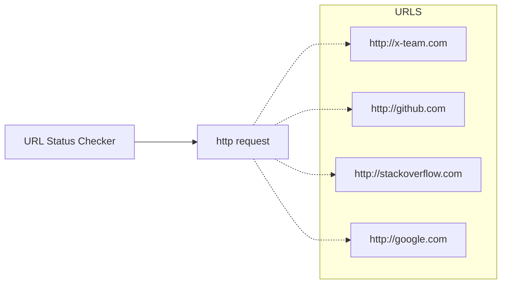
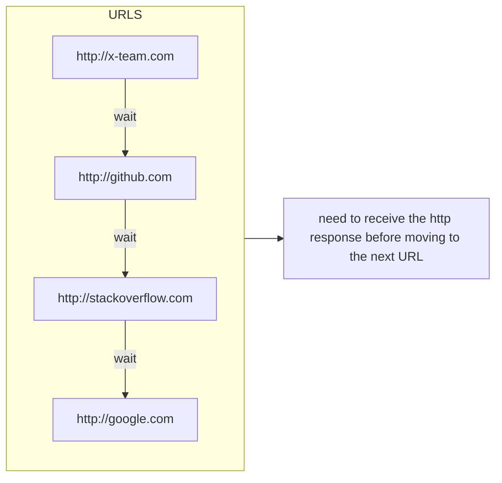
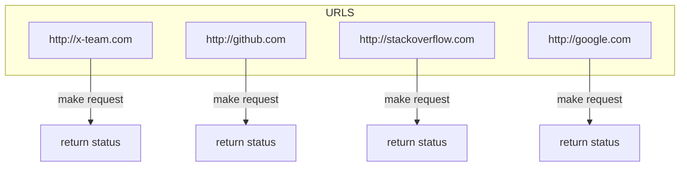
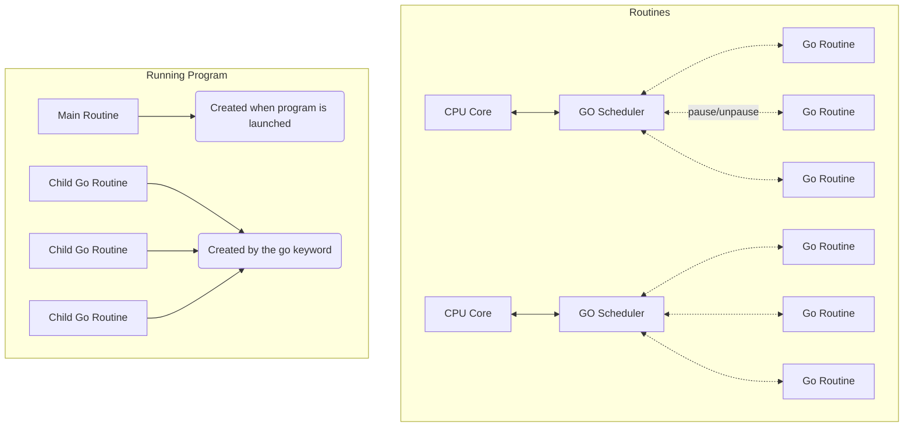
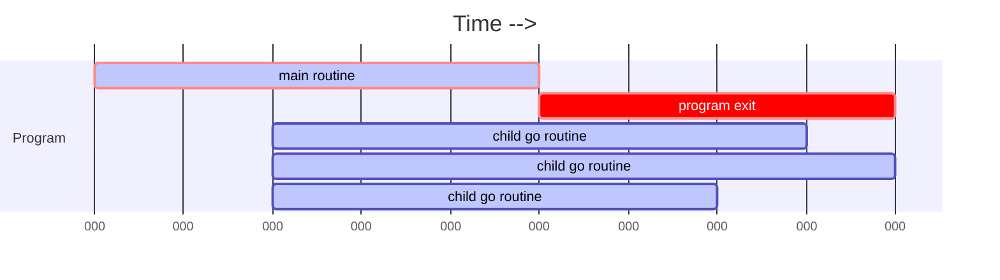
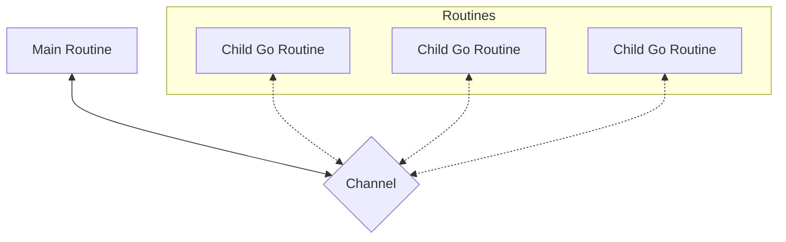

# Golang Concurrency vs Parallelism

## Single Threaded vs Multi-Threaded Programs

Imagine You have to mine some ores using gophers, you'll have **Gary** as our worker:

A common way of performing this task on single Threaded applications is by using **Gary** through all the stages of the mining, like this:

That's fine and all, but it really doesn't take advantage of maybe assigining different tasks to different workers, like this:

That's what we call concurrent programming, defined by:

> In computer science, concurrency is the ability of **different parts** or **units** of a program, algorithm, or problem to be **executed out-of-order** or at the same time simultaneously partial order, **without affecting** the final outcome.

While parallelism is defined by:

>The term Parallelism refers to **techniques to make programs faster** by performing **several computations at the same time**. This requires hardware with **multiple** processing units. In many cases the sub-computations are of the same structure, but this is not necessary.

## **Case Study** : URL Status Checker
---

1. Application Basic Logic:

2. This program has a **natural** blocking architecture:

3. Why not try to optimize this?

4. Behind the Scenes

5. Why the child routines didn't run?

6. The plan with Channels
